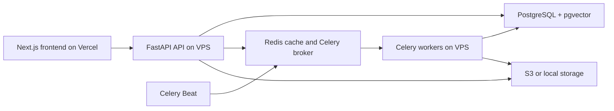

# Conserium Architecture

Conserium is a feature-first modular monolith. The backend follows the useful parts of
Polar's FastAPI structure without copying Polar's scale, Dramatiq worker choice, or
JavaScript monorepo.

## System Boundaries



The frontend and backend deploy independently. Deployment topology does not determine
repository topology.

## Backend Structure

```text
src/
├── main.py                # FastAPI application and lifespan
├── api.py                 # Central /api/v1 router registration
├── postgres.py            # Async engine and request transaction dependencies
├── routing.py             # Shared routing exports
├── exceptions.py          # HTTP exception translation
├── settings.py            # Environment-backed configuration
├── models/                # Shared SQLAlchemy models
├── kit/                   # Cross-cutting code only
├── worker/                # Celery app, queues, registry, and shared worker helpers
└── {feature}/             # Feature-owned behavior
```

Primary feature packages include `documents`, `collections`, `workspaces`,
`public_shares`, `query`, `chats`, `review`, `topics`, `knowledge_graph`,
`knowledge_gaps`, `learning_goals`, `drafts`, `integrations`, `notifications`,
`repo_syncs`, `api_keys`, `users`, and `auth`.

## Feature Modules

A feature owns the files it needs:

- `endpoints.py`: HTTP parsing, dependency declarations, status codes, and response construction.
- `schemas.py`: Pydantic request, response, and feature data contracts.
- `service.py`: business rules and orchestration.
- `repository.py`: SQLAlchemy statements and persistence operations.
- `auth.py`: feature authorization dependencies.
- `tasks.py`: feature-owned Celery task entry points.
- `sorting.py`: sort definitions when the feature supports sorting.

These filenames are conventions, not a requirement to create empty files. Add a file only
when the feature owns that behavior.

Large features may split cohesive behavior into additional files such as
`documents/ingestion.py`, `documents/processing.py`, and `documents/notes.py`. Do not
recreate generic `application`, `domain`, `infrastructure`, `use_cases`, `dtos`, or
feature-local `ports` layers.

## Request Flow

```text
HTTP request
  -> feature endpoint
  -> feature service
  -> feature repository
  -> shared SQLAlchemy model
  -> response schema
```

Rules:

1. Endpoints stay thin and do not construct SQLAlchemy statements.
2. Services contain business decisions and compose feature behavior.
3. Repositories own database queries and persistence details.
4. Cross-feature calls use the owning feature's public service or repository API.
5. External systems use protocols only when substitution is real: AI, cache, storage,
   OAuth, tracing, notifications, and worker dispatch.

## Transactions

`src.postgres.get_db_session` owns the HTTP write transaction:

- commit after a successful request;
- rollback when request handling raises;
- close the session when the dependency exits.

New request-path services must not call `session.commit()`. Use `session.flush()` when a
generated value or constraint must be visible before the request ends.

Workers own their task transaction boundary. A worker may commit an explicit checkpoint
only when the task is deliberately resumable and the partial state is part of the task's
failure model. That decision belongs in worker or processing code, not ordinary HTTP
services.

Public-share abuse accounting commits its reservation before a rejected or expensive
external query so concurrent requests cannot bypass daily limits. This is an explicit
transaction boundary, not ordinary request persistence.

## Database Models and Repositories

SQLAlchemy models are shared in `src/models`, matching Polar's global model package.
Feature repositories import those models and expose concrete repository APIs.

Prefer direct concrete repositories when there is one implementation. Keep interfaces for
external adapters or genuinely interchangeable implementations, not for every SQLAlchemy
repository.

Document HTTP services receive the request `AsyncSession` and concrete repositories.
Repositories keep their session private; services use the request session directly when a
flush is required. Core document endpoints depend on one cohesive `DocumentService` rather
than an action-specific dependency per route.

## Background Jobs

Celery remains the worker system.

- `src/worker/app.py` configures Celery, Redis broker URLs, queues, routing, and Beat.
- `src/worker/registry.py` lists feature task modules.
- `src/worker/task_names.py` defines stable producer-facing task names.
- Feature `tasks.py` files own task entry points and delegate to feature processing code.

Production processes:

| Process | Queues or responsibility |
|---|---|
| `worker-default` | `document_processing`, `notifications`, `cleanup` |
| `worker-embeddings` | `embeddings` |
| `worker-media` | `media_processing`, `hf_processing` |
| `scheduler` | Celery Beat schedules |

Redis database `2` is the Celery broker, Redis database `1` is the result backend, and
Redis database `0` is application cache/state.

The HTTP application owns one cached Redis client in `src/kit/cache/redis.py`. Feature
cache adapters receive that shared client. Worker processes own separate Redis clients and
close them at the task boundary.

## Shared Code

`src/kit` is limited to code that has multiple feature consumers:

- base schemas, pagination, sorting, and repository helpers;
- AI, cache, storage, and security adapters;
- protocols for external systems with real alternate implementations;
- shared exceptions and constants.

Feature-specific records, repository composition, and business rules stay in the owning
feature package.

## Frontend Contract

The frontend is maintained in the separate `conserium_client` repository and deployed to
Vercel. It uses `openapi-typescript` and `openapi-fetch`.

Contract flow:

1. Run `uv run python -m scripts.export_openapi openapi.json` in the backend.
2. Backend CI fails when the committed schema differs from the application schema.
3. Backend CI uses `oasdiff` to reject breaking changes against the pull request base branch.
4. Frontend CI regenerates `src/lib/api/generated/v1.ts` from backend `main` and fails on a
   diff.
5. Type-check and test the frontend.

Backend changes that intentionally alter the contract update `openapi.json`. The frontend
generated client and wrappers then update in the frontend repository before its deployment.

Manual frontend transport is limited to behavior that generated JSON clients do not model
well: login/refresh bootstrap, multipart uploads, binary downloads, and SSE.

## Deployment

Backend production runs on a VPS through Docker Compose:

- FastAPI application behind Nginx;
- PostgreSQL with pgvector;
- Redis;
- three Celery workers;
- Celery Beat;
- Prometheus and Grafana.

The Next.js frontend deploys independently to Vercel and calls the public API origin.
CORS is controlled by `FRONTEND_URL`.

## Repository Decision

Conserium should remain in two repositories for now.

Polar benefits from a monorepo because it contains multiple web and mobile applications,
shared UI and SDK packages, generated clients, documentation, infrastructure, and release
tooling. Conserium currently has one backend and one web application with independent
deployments. Moving files would add workspace and deployment complexity without removing
the main contract risk.

Reconsider a monorepo when at least one of these becomes true:

- a mobile or second web application needs shared TypeScript packages;
- a reusable UI package or public SDK becomes a product boundary;
- most product changes require atomic backend, generated-client, and frontend commits;
- one CI pipeline is needed to coordinate compatibility and releases.

The separate CI checks enforce the OpenAPI contract without requiring a monorepo.

## Architecture Checks

The architecture test suite prevents removed layers, Dishka, global UOW names, document
repository sessions, request-path commits, SQLAlchemy inside endpoints, empty convention
placeholders, and feature-local `dtos`, `ports`, or `use_cases` folders from returning.

Run:

```bash
uv run ruff check src tests scripts/run_eval_harness.py scripts/backfill_topics.py
uv run mypy src
uv run pytest tests -q
```

Architecture tests should enforce dependency direction and behavior. They should not force
empty convention files or rely only on banned class names.
